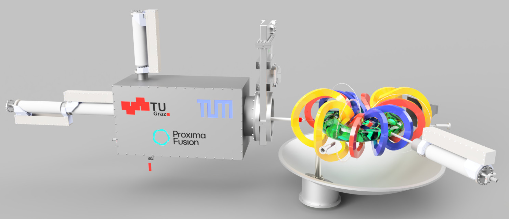

# ALPES - Adaptable Lab for Plasma Experiments in Stellarators

This project contains contributions towards a university-scale stellarator experiments. Results are provided as open source / open data / open educational resources and re-use is encouraged. The initial release is built on the outcome of the joint course "Fusion Reactor Design" in summer 2024 by TU Graz, TU Munich and Proxima Fusion.

## License

Source code and directly related documentation are licensed under the MIT license according to the [LICENSE](LICENSE) file.

Documentation and data not directly related to source code are licensed under the CC BY 4.0 license according to the [LICENSE-docs](LICENSE-docs) file.

Attribution for re-use goes to *The ALPES Team*. When building on our work, we would appreciate a citation of the Zenodo entry and other related publications.
